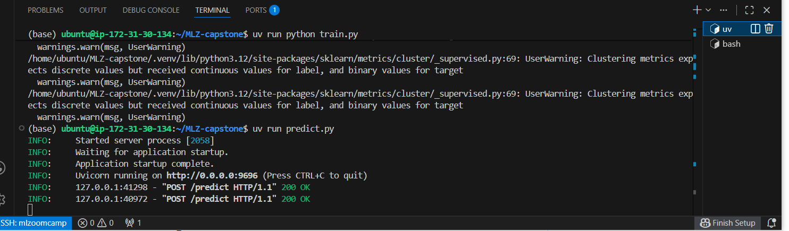
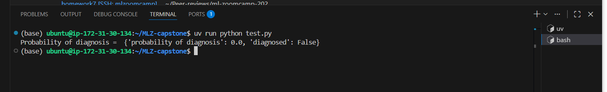

# Predicting diabetic potential in patients

This project trains a model on a dataset to determing if an individual is likely to be diagonsed with diabetes or not depending on some of their intrinsic attributes and habits. It is important to identify the potential of people to become diabetic since it can lead to early treatment and follow up, which could improve the patients health. May people may not be aware that they are becoming diabetic until it is too late. Such a machine learning model to predict potential of diabetes in patients would be of great benefit to everyone seeking to stay healthy.

## Project files
- The dataset is "diabetes_prediction_dataset.csv.
- The jupyter notebook is "diabetes_prediction.ipynb" and contains the exploratory data analysis and model evaluation and predictions.
- The final ML model trained is in "train.py"
- The saved ML model is "model.bin".
- The script used to deploy the model online as a webservice is "predict.py"
- The script used to predict new users is in "test.py"
- The script used to manage the cloud deployment dependencies is in "Dockerfile"

## How to make use of this repository (repo for short)
To make use of this repository and run the codes to train the model and test predictions do the following in a terminal (preferably linux-like):
- clone the repository: "git clone [repo url]"
- change directory to the repo: "cd [repo name]"
- Install uv : "pip install uv" or "sudo apt install uv"
- Install the virtual environment: "uv sync --locked"
- Run the train.py script: "uv run python train.py"
- Run the predict.py script: "uv run predict.py"
- Uncomment the url for FastAPI webservice in test.py script and then in a new terminal: "uv run python test.py"
- Kill the webservice then build the docker image: "docker build -t predict-diabetes ."
- Run the docker image "docker run -it --rm -p 9696:9696 predict-diabetes"
- In a new terminal run : "uv run python test.py"
- SSH into an virtual machine in the cloud and repeat the steps above.
- Then for elastic bean stalk run: uv run eb init –p docker –r [region] loan-serving-env
- Then run: "uv run eb create predict-diabetes".
- Modifie the url in test.py script to the cloud url you get after the previous step.
- Then run: "uv run python test.py"
- Finally terminate the instance: "uv run eb terminate predict-diabetes"
- Type the name of the enviroment at the prompt request and wait until it shuts down.
- Shut down the EC2 instance.

## Exploratory data analysys
Exploratory data analysis was performed on the dataset. There are no missing values, however the dataset is highly imbalanced as less than 10% of the data belongs to one class in the two-class dataset. With such a high class imbalance, metrics like accuracy would not be suitable for evaluating the machine learning model to be realized. The diabetes feature or variable is our target variable which we would like to predict.

## Model training
To train a machine model to predict the target variable (i.e. diabetes), we have to find out the best possible model to use. This entails selecting a number of models and tuning them to find out which model performs best with respect to a given metric. The metric used here is the roc_auc_score and the root-mean-squared error (rmse). We would like the best model to have the highest roc_auc_score and the smallest rmse value.

Given that the target variable is a binary feature, it can be best presented as a classification task. We tried three different classifiers:
- LogisticRegression
- DecisionTreeClassifier
- RandomForestClassfier

To get the best peformance from model training, it is usual to split the dataset into three parts: training, validation, and test sets. The training is used to train the model, while the validation is used for tuning the model, and finally the test set is used for testing the final model.

For the LogisticRegression, we found that the 'lbfgs' solver peforms very similarly to the 'liblinear' solver. However, we used the 'liblinear' solver subsquently because of its lower computational cost. We also tuned the regularization factor value 'C' and found the best value of C=1 which gave an roc_auc_score of 0.96, and an rmse score of 0.18 after 5-fold cross-validation.

For the DecisionTreeClassifier, we tuned the max_depth parameter and number of estimators and found that a max_depth of 10 for 60 estimators resulting in an roc_auc_score of 0.97 and an rmse score of 0.15. We did not proceed further to tune the minimum samples per leaf values because we already have almost 100% roc_auc_score.

For the RandomForestClassifier, we found the optimal number of estimators to be 60, and the maximum depth to be 10 resulting in an roc_auc_score of 0.93 and an rmse of 0.16.

Comparing the three classifiers above the DecisionTreeClassifier has the best combined values for the roc_auc_score and the rmse. Hence we chose this classifier as the best and used it to train the combined train and validation data sets. We finally tested its performance on the test dataset and obtained an roc_auc_score of 0.97 and an rmse of 0.15, which shows that the model is able to predict unseen values very accurately.

## Deploying resulting ML model as a web service
To make this model useful to external party (e.g. the medical practitioner or the patient), is it necessary for the model to be hosted where it can be easily accessed. Hosting it as a web service fulfils this condition. Here we first save the model as a script and then use FastAPI with uvicorn to deploy it as a web service. This web service can be queried with new user information through the following url below:

url = "http://localhost:9696/predict"

To deal with dependencies, we can use virtual environment such as those defined with uv to isolate versions of libraries to our web service. We could also go a step further to containerise our webservice which will facilitate deployment to the cloud. We use docker for such a containerization. After creating a dockerfile and doing the containerization with the commands below, the webservice can still be accessed through the same url above.

docker build -t predict-diabetes .

docker run -it --rm -p 9696:9696 predict-diabetes

To evaluate a patient's diabetes risk, we can run:

uv run python test.py

and the result of the evaluation will be displayed in the command line.

## Deploying resulting web service in the cloud

Containerization makes the web service suitable for deployment in the cloud. For this, we would use elastic bean stalk.

This requires renting a virtual EC2 machine on AWS, SSHing into it, and then installing the required libraries. Next we install the aws elastic bean stalk command line interface "awsebcli" and use it to deploy our webservice to the cloud. Upon deployment, the webservice can be queried using the following url from the test.py script.

url = "http://diabetes-prediction.eba-wik35p9p.us-east-1.elasticbeanstalk.com/predict"

You would need to comment the docker url and then uncomment this cloud url to test it.

The following pictures are screenshots of the model deployment in action:

Predict.py running from invocation of fastapi app.

Test.py running from fastapi url.

Building the docker image.

Docker imager running and docker URL available.

Test.py running through docker image URL.

Cloud ennvironment instantiated on elasticbean

Test.py running from elastic bean cloud URL.

# Credits
I would like to immensely thank *Alexey Grigorev* for being so generous with his time and resources to provide a very practical training on real world applications of Machine Learning. I have learnt a whole lot in a shorter time than I would have spent learning on my own. Thank you very much Alexey.